# Clases Python

<p align="left">
   
  
</p>

## Índice

1. [Preparación del Entorno](#preparación-del-entorno)
   - [Instalación de Visual Studio Code](#instalación-de-visual-studio-code)
   - [Instalación de Antigravity](#instalación-de-antigravity)
   - [Conexión a GitHub](#conexión-a-github)
2. [Introducción a Python](#introducción-a-python)
   - [Hablando con la máquina](#hablando-con-la-máquina)
   - [Código máquina](#código-máquina)
   - [Ensamblador](#ensamblador)
   - [C](#c)
   - [Python](#python)
   - [Compiladores](#compiladores)
3. [¿Qué es Python?](#¿Qué-es-Python?)
   - [Ventajas](#ventajas)
   - [Desventajas](#desventajas)
   - [Aplicaciones de Python](#aplicaciones-de-python)
   - [El Zen de Python](#el-zen-de-python)
   - [Consejos para programar](#consejos-para-programar)
4. [Tipos de Datos](#tipos-de-datos)
   - [Qué es un dato](#qué-es-un-dato)
   - [Tipos de datos](#tipos-de-datos-1)
   - [Conociendo los tipos de datos](#conociendo-los-tipos-de-datos)
   - [Variables](#variables)
   - [Reglas para nombrar una variable](#reglas-para-nombrar-una-variable)
   - [Convenciones para nombres](#convenciones-para-nombres)
   - [Constantes](#constantes)
   - [Elegir buenos nombres](#elegir-buenos-nombres)
   - [Asignación](#asignación)
   - [Asignando una variable a otra variable](#asignando-una-variable-a-otra-variable)
   - [Conocer el valor de una variable](#conocer-el-valor-de-una-variable)
   - [Mutabilidad (explicado muy sencillo)](#mutabilidad-explicado-muy-sencillo)
   - [Conversiones implícitas y explícitas](#conversiones-implícitas-y-explícitas)
   - [Función print, type y input](#función-print-type-y-input)
5. [Estructuras de Control](#estructuras-de-control)
   - [Control de flujo](#control-de-flujo)
   - [Comentarios](#comentarios)
   - [Definición de bloques](#definición-de-bloques)
   - [Condicionales (if, elif, else)](#condicionales-if-elif-else)
   - [Ciclos (for)](#ciclos-for)

---

## Preparación del Entorno

Antes de comenzar a escribir nuestras primeras líneas de código en Python, es fundamental preparar nuestro **entorno de desarrollo**. Podríamos decir que es como armar nuestra mesa de trabajo antes de empezar a construir un robot.

---

### Instalación de Visual Studio Code

Para programar necesitamos un lugar donde escribir nuestras **instrucciones**, y aunque podríamos usar el bloc de notas de nuestra computadora, lo ideal es usar un **Editor de Código**. El editor nos va a facilitar muchísimo la tarea resaltando el código con colores, ayudándonos a encontrar errores y permitiéndonos ejecutar nuestros programas de forma rápida. 

En este curso utilizaremos **Visual Studio Code** (o simplemente VS Code), que es uno de los editores más populares, potentes y, lo mejor de todo, ¡es completamente gratuito!

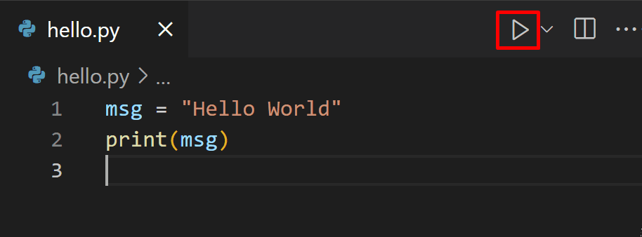

Veamos los pasos para instalarlo:

1. **Descargar el instalador:**
   Primero debemos dirigirnos a la página oficial de VS Code: [code.visualstudio.com](https://code.visualstudio.com/). Allí veremos un botón azul grande que dice **Download for Windows** (o el sistema operativo que estemos usando). Hacemos clic y descargamos el archivo instalador.
   
   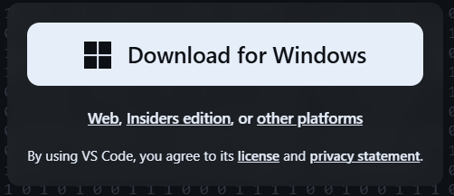

2. **Ejecutar el instalador:**
   Una vez descargado, abrimos el archivo y seguimos las instrucciones del asistente. Es una instalación clásica de "Siguiente", "Siguiente", pero es **muy importante** que en una de las pantallas nos aseguremos de marcar las casillas que dicen:
   - *Agregar la acción "Abrir con Code" al menú contextual del archivo de Windows Explorer.*
   - *Agregar la acción "Abrir con Code" al menú contextual del directorio de Windows Explorer.*
   
   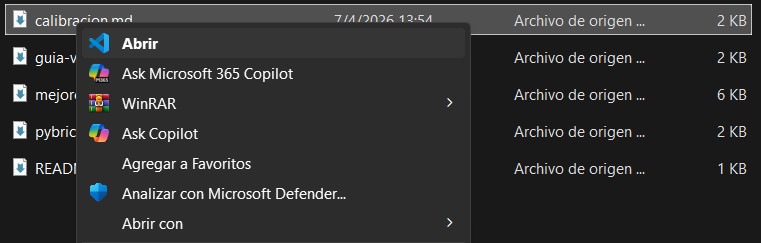
   
   > Esto nos va a permitir hacer clic derecho en cualquier carpeta y abrirla directamente en VS Code, lo cual nos va a resultar súper cómodo para nuestros proyectos.

3. **Instalar la extensión de Python:**
   Visual Studio Code por sí solo es como un lienzo en blanco; necesita que le digamos en qué lenguaje vamos a trabajar. Para ello usamos las **Extensiones**.
   - Abrimos VS Code.
   - En el menú lateral izquierdo, hacemos clic en el ícono que parece un cuadrado formado por bloques (o presionamos `Ctrl+Shift+X`).
   
     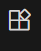
     
   - En el buscador escribimos **Python** y seleccionamos la primera opción publicada por **Microsoft**.
   - Hacemos clic en el botón de **Instalar**.

¡Y listo! Con esto ya tenemos nuestro editor principal preparado para entender y ejecutar nuestro código en Python.

---

### Instalación de Antigravity

Además de usar editores de código tradicionales, hoy en día contamos con herramientas que vienen con "superpoderes" desde fábrica. **Antigravity** es un Entorno de Desarrollo Integrado (IDE) creado específicamente para trabajar codo a codo con Inteligencia Artificial. Podríamos decir que es como tener a un profe o a un compañero de programación sentado al lado nuestro mientras escribimos código: nos va a ayudar a encontrar errores, explicarnos partes que no entendamos e incluso darnos sugerencias.

Veamos los pasos para instalar el programa completo y configurarlo:

1. **Descargar el IDE:**
   Debemos ingresar a la página oficial de Antigravity en [https://antigravity.google/](https://antigravity.google/) y buscar la sección de descargas. 
   
   
   
   Asegurate de seleccionar la versión **x64** correspondiente a tu sistema operativo (Windows, en este caso), para que funcione de manera óptima en tu computadora. Hacemos clic y descargamos el instalador.
   
   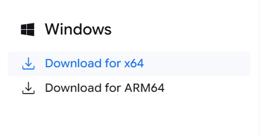

2. **Ejecutar la instalación:**
   Una vez descargado el archivo, lo abrimos y seguimos las instrucciones del asistente en pantalla. Es una instalación sencilla, similar a cualquier otro programa, donde vamos dándole a "Siguiente" hasta finalizar.

3. **Vincular nuestra cuenta de Google:**
   Para que Antigravity pueda usar todo su potencial de Inteligencia Artificial, necesita que iniciemos sesión. ¡No te preocupes, es un proceso súper rápido!
   - Al abrir el programa por primera vez, nos va a pedir que iniciemos sesión para habilitar el asistente.
   - Al hacer clic en el botón para ingresar, se abrirá automáticamente una pestaña en nuestro navegador web predeterminado.
   - En esa pestaña, seleccionamos nuestra **cuenta de Google** (puede ser tu cuenta personal o la que uses para las clases) y aceptamos los permisos necesarios para vincularla.

4. **¡A programar!**
   Una vez que el navegador confirme que el inicio de sesión fue exitoso, podés volver a la ventana de Antigravity. Verás que tu entorno ya está activo y el asistente listo para charlar con vos en su panel lateral. Podés escribirle como si fuera un chat normal para hacerle consultas sobre tus proyectos.

> **Consejo:** Acostumbrate a preguntarle a Antigravity cuando te tranques con algún problema o no sepas cómo arrancar un ejercicio. Es una herramienta buenísima para acelerar nuestro aprendizaje.

---

### Conexión a GitHub

¡Llegó el momento de conectar nuestro código con el mundo! **GitHub** es como una red social para programadores donde podemos guardar nuestros proyectos (repositorios) de forma segura en la nube, llevar un control de los cambios que hacemos y trabajar en equipo.

Para poder subir nuestros avances o descargar el código de la clase, necesitamos conectar nuestro editor con GitHub. Veamos paso a paso cómo hacerlo, tanto de forma tradicional como usando Antigravity.

#### 1. Vincular GitHub con VS Code y clonar un repositorio

Antes de empezar a tirar comandos, lo más fácil es **clonar** (descargar) un repositorio que ya exista en GitHub.
- Abrimos VS Code.
- En el menú lateral izquierdo, hacemos clic en el ícono de **Control de código fuente** (Source Control), que parece una ramita con nodos.
- Hacemos clic en el botón que dice **Clone Repository** (Clonar repositorio).
- VS Code nos pedirá permiso para acceder a nuestra cuenta de GitHub. Le damos a **Permitir** y se abrirá una pestaña en el navegador para iniciar sesión.
- Una vez vinculada la cuenta, nos dejará elegir un repositorio de nuestra lista o pegar la URL del repositorio que queremos clonar.
- Elegimos la carpeta de nuestra computadora donde queremos guardarlo ¡y listo!

#### 2. Comandos tradicionales de Git (Terminal)

Aunque VS Code tiene botoncitos para todo, como buenos programadores **tenemos que conocer los comandos básicos** en la terminal. Para abrir la terminal en VS Code vamos al menú superior `Terminal -> New Terminal`.

Lo primero es **configurar nuestra identidad** (sólo se hace una vez por computadora) para que Git sepa quién está haciendo los cambios:

```bash
git config --global user.name "Tu Nombre"
git config --global user.email "tu_correo@ejemplo.com"
```

Ahora, el ciclo de vida de nuestro código (lo que haremos cada vez que terminemos un ejercicio):

1. **Añadir los cambios:** Le decimos a Git qué archivos modificados queremos preparar para subir. El punto `.` significa "todos los archivos".
   ```bash
   git add .
   ```

2. **Crear un punto de guardado (Commit):** Guardamos esos cambios con un mensaje claro de lo que hicimos.
   ```bash
   git commit -m "Agrego ejercicio de variables"
   ```

3. **Subir los cambios a GitHub (Push):** Enviamos nuestros commits a la nube.
   ```bash
   git push
   ```

> **Nota sobre la contraseña:** A veces, al hacer el `git push`, la terminal nos pedirá nuestro usuario y contraseña de GitHub, pero la plataforma ya no acepta contraseñas normales por motivos de seguridad. En su lugar, nos exige usar un **Token de Acceso Personal (PAT)**. 

Veamos cómo generar este Token paso a paso:

1. Iniciamos sesión en la web de GitHub y hacemos clic en nuestra foto de perfil arriba a la derecha. En el menú desplegable, seleccionamos **Settings** (Ajustes).
   
   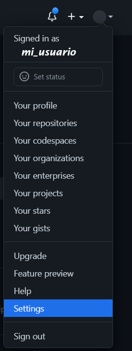

2. En el menú de la izquierda, bajamos hasta el final y entramos a **Developer settings**.
   
   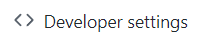

3. Allí, desplegamos la opción **Personal access tokens** en el menú de la izquierda.
   
   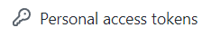

4. Hacemos clic en el botón **Generate new token**.
   
   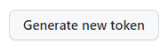

5. Por seguridad, GitHub nos pedirá que confirmemos nuestra contraseña normal.
   
   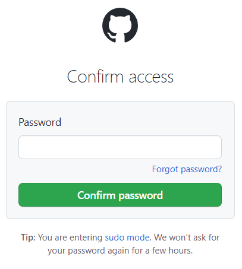

6. En el campo **Note**, escribimos un nombre para identificar este token (por ejemplo: "Clases Python VS Code").
   
   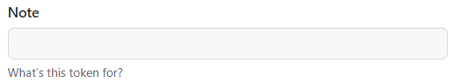

7. Elegimos cuándo queremos que venza el token en el menú **Expiration** (podemos ponerle la duración del curso, por ejemplo, 90 días).
   
   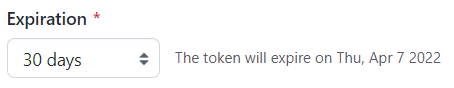

8. Ahora la parte importante: **los permisos**. Para que podamos subir y bajar código sin problemas durante el curso, marquemos las casillas relativas a **repo**, **workflow** y **user**.
   
   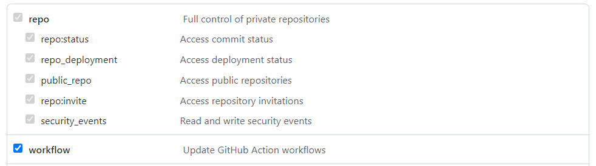

9. Bajamos hasta el final de la página y hacemos clic en el botón verde **Generate token**. ¡Y listo! Copiamos ese código larguísimo que nos aparece y **lo guardamos en un lugar seguro**, porque GitHub no nos lo volverá a mostrar. 
   
   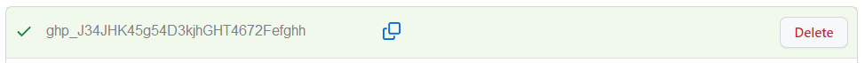

Este token es el que vamos a pegar en nuestra terminal cuando nos pida la contraseña al hacer `git push`. (Recordá que en la terminal de comandos, al pegar contraseñas, no se ven los caracteres por seguridad, pero ¡tranquilo que están ahí!).

**Otros comandos súper útiles para el día a día:**

Además del ciclo básico, hay algunas instrucciones que nos van a sacar de apuros más de una vez. ¡Tomalas como tus herramientas de rescate!

- **Ver el estado de nuestros archivos (Status):** Nos dice qué archivos modificamos, cuáles están listos para el commit y si estamos al día con GitHub. Es como preguntarle a Git: *"¿Cómo venimos?"*
  ```bash
  git status
  ```

- **Traer cambios desde GitHub (Pull):** Si estuvimos trabajando desde otra compu o un compañero subió código nuevo, con esto lo descargamos y actualizamos nuestra computadora.
  ```bash
  git pull
  ```

- **Clonar por terminal (Clone):** Si preferís usar comandos en lugar de los botones para descargar un proyecto, solo necesitás la URL del repo.
  ```bash
  git clone https://github.com/usuario/mi-proyecto.git
  ```

- **Ver el historial (Log):** Te muestra una lista de todos los "puntos de guardado" (commits) que hicimos hasta ahora, con sus mensajes y fechas.
  ```bash
  git log
  ```

- **Deshacer cambios locales (Restore):** ¡Cuidado con este! Si tocaste un archivo, rompiste el código y querés volver a la última versión guardada (descartando tus cambios actuales).
  ```bash
  git restore nombre_del_archivo.py
  ```#### 3. La magia de Antigravity

Como ya vimos, **Antigravity** viene con superpoderes, y manejar GitHub no es la excepción. Si usamos este IDE, el proceso es muchísimo más rápido y automatizado gracias a su asistente.

- Al intentar hacer algún cambio, clonar o hacer un *push* desde la interfaz de Antigravity, el asistente detectará si necesitamos autenticarnos y lo hará de forma transparente a través de la cuenta de Google que ya vinculamos, o nos guiará paso a paso para darle acceso a GitHub sin tener que lidiar con tokens manuales.
- ¡Aún mejor! Si no te acordás de los comandos de la terminal, podés pedirle directamente al asistente en el chat: *"Guardá mis cambios y subilos a GitHub con el mensaje 'Terminé la tarea'"*. La IA se encargará de ejecutar el `git add`, `git commit` y `git push` por nosotros.

Con esto ya estamos listos para guardar nuestros proyectos seguros en la nube y compartirlos.


## Introducción a Python

### Hablando con la máquina

Las computadoras son dispositivos complejos pero están diseñadas para **ejecutar aquello que se les indica**. La cuestión es cómo indicar a un ordenador lo que queremos que ejecute. Esas **indicaciones** se llaman técnicamente **instrucciones y se expresan en un lenguaje**. 

Podríamos decir que **programar consiste en escribir instrucciones para que sean ejecutadas por un ordenador**. El lenguaje que utilizamos para ello se denomina lenguaje de programación.

---

### Código máquina

Aún así seguimos con el problema de cómo vamos a hacer que nuestra computadora (o cualquier otra máquina entienda el lenguaje de programación). Seguramente escuchamos que la computadora únicamente entiende un lenguaje simple, denominado **código máquina** donde se usan **0 y 1** en representación de niveles de tensión alto y bajo, que son los estados que puede manejar un circuito digital.

Hablamos del **sistema binario** y si tuvieramos que escribir nuestros programas en este formato sería una tarea difícil, pero afortunadamente para nosotros, con el tiempo se crearon lenguajes de programación intermedios que, posteriormente son convertidos a código máquina (sin que tengamos que saber como hacerlo nosotros).

Un ejemplo de un programa en código máquina sería algo así:

```
00001000 00000010 01111011 10101100 10010111 11011001 01000000 01100010
00110100 00010111 01101111 10111001 01010110 00110001 00101010 00011111
10000011 11001101 11110101 01001110 01010010 10100001 01101010 00001111
11101010 00100111 11000100 01110101 11011011 00010110 10011111 01010110
```

---

### Ensamblador

El primer lenguaje que vamos a mencionar en esta introducción es **ensamblador**, un lenguaje de bajo nivel. Veamos un ejemplo en este lenguaje del primer programa que escribimos por primera vez, el famoso **"Hola mundo!"**:

```assembler
SYS_SALIDA equ 1

section .data
    msg db "Hola mundo!",0x0a
    len equ $ - msg ;longitud de msg
section .text
global _start ;para el linker
_start: ;marca la entrada
    mov eax, 4 ;llamada al sistema (sys_write)
    mov ebx, 1 ;descripción de archivo (stdout)
    mov ecx, msg ;msg a escribir
    mov edx, len ;longitud del mensaje
    int 0x80 ;llama al sistema de interrupciones
    
fin: mov eax, SYS_SALIDA ;llamada al sistema (sys_exit)
    int 0x80
```

Aunque nos resulte raro, lo "único" que hace este programa es mostrar en la pantalla de nuestra computadora la frase **"Hola mundo!"** y tomando en cuenta que solo funcionará para algunas computadoras.

---

### C

Si bien el lenguaje ensamblador nos facilitó un poco la tarea de desarrollar programas, sigue siendo bastante complicado ya que sus instrucciones son muy específicas y no nos proporcionan una semántica que sea fácil de leer. 

El lenguaje que vino a suplir (por parte) estos obstáculos fue **C**. Es considerado por muchos programadores como un referente en cuanto a los lenguajes de programación, brindando instrucciones más claras y potentes. Veamos el mismo ejemplo pero ahora en lenguaje C:

```c
#include <stdio.h>

int main() {
    printf("Hola Mundo!");
    return 0;
}
```

---

### Python

Avanzando en el tiempo en nuestro mini-recorrido por lenguajes de programación y subiendo escalones, llegaremos hasta **Python**. 

Decimos que es un programación de **más alto nivel** en el sentido de que sus instrucciones son más entendibles por un humano. Veamos el **"Hola mundo!"** escrito en Python:

```python
print('Hola Mundo!')
```

Bastante sencillo de entender si lo comparamos con el lenguaje máquina de esos abundantes **0 y 1**. Python es un lenguaje con el que podemos entender perfectamente lo que le estamos indicando a nuestra computadora.

Pero... ¿cómo entiende una computadora lo que tiene que hacer si le pasamos un programa hecho en Python (o en cualquier otro lenguaje de alto nivel)? La respuesta es un **compilador**.

---

### Compiladores

Los **compiladores** son programas que convierten un lenguaje "cualquiera" en código máquina. Se pueden ver como **traductores**, permitiendo a la máquina interpretar lo que queremos hacer.

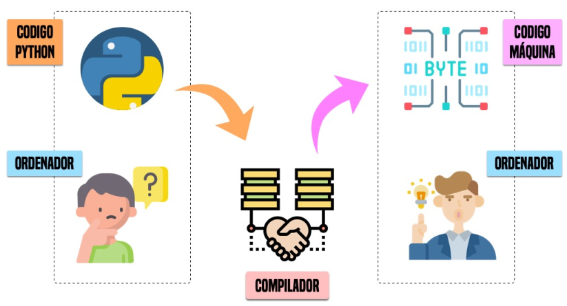

En el caso particular de Python el proceso de compilación genera un código intermedio llamado **bytecode**.

Si partimos del anterior ejemplo:

```python
print('Hola Mundo!')
```

el programa se compilaría al siguiente **bytecode**:

```bytecode
0       0 RESUME          0

1       2 PUSH_NULL
        4 LOAD_NAME       0 (print)
        6 LOAD_CONST      0 ( Hello, World )
        8 PRECALL         1
        12 CALL           1
        22 RETURN_VALUE
```

A continuación estas instrucciones básicas son ejecutadas por el intérprete de «bytecode» de Python (o máquina virtual).

## ¿Qué es Python?

Python es un lenguaje de programación de **alto nivel** creado a principios de los 90 por un holandés llamado Guido van Rossum. Sus instrucciones están muy cercanas al **lenguaje natural** en inglés y se resalta en la **legibilidad** del código.

Según su definición de Wikipedia:

- Python es un lenguaje de programación **interpretado** y **multiplataforma** cuya filosofía hace hincapié en una sintaxis que favorezca un **código legible**.

- Se trata de un lenguaje de programación **multiparadigma**, ya que soporta **orientación a objetos**, **programación imperativa** y, en menor medida, **programación funcional**.

- Añadiría, como característica destacada, que se trata de un **lenguaje de propósito general**.

---

### Ventajas

- Libre y gratuito (OpenSource).
- Fácil de leer, parecido a pseudocódigo.
- Aprendizaje relativamente fácil y rápido: claro, intuitivo….
- Alto nivel.
- Alta Productividad: simple y rápido.
- Tiende a producir un buen código: orden, limpieza, elegancia, flexibilidad, …
- Multiplataforma. Portable.
- Multiparadigma: programación imperativa, orientada a objetos, funcional, …
- Interactivo, modular, dinámico.
- Librerías extensivas («pilas incluídas»).
- Gran cantidad de librerías de terceros.
- Extensible (C++, C, …) y «embebible».
- Gran comunidad, amplio soporte.
- Interpretado.
- Tipado dinámico. (significa que una variable puede cambiar de tipo durante el tiempo de vida de un programa. C es un lenguaje de tipado estático.)
- Fuertemente tipado (significa que, de manera nativa, no podemos operar con dos variables de tipos distintos, a menos que realice una conversión explícita. Javascript es un lenguaje débilmente tipado.)

---

### Desventajas
- Interpretado (velocidad de ejecución, multithread vs GIL, etc.).
- Consumo de memoria.
- Errores no detectables en tiempo de compilación.
- Desarrollo móvil.
- Documentación a veces dispersa e incompleta.
- Varios módulos para la misma funcionalidad.
- Librerías de terceros no siempre del todo maduras.

---

### Aplicaciones de Python

Al ser un lenguaje de propósito general, podemos encontrar aplicaciones prácticamente en todos los campos científico-tecnológicos:

- Análisis de datos.
- Aplicaciones de escritorio.
- Bases de datos relacionales / NoSQL
- Buenas prácticas de programación / Patrones de diseño.
- Concurrencia.
- Criptomonedas / Blockchain.
- Desarrollo de aplicaciones multimedia.
- Desarrollo de juegos.
- Desarrollo en dispositivos embebidos.
- Desarrollo web.
- DevOps / Administración de sistemas / Scripts de automatización.
- Gráficos por ordenador.
- Inteligencia artificial.
- Internet de las cosas.
- Machine Learning.
- Programación de parsers / scrapers / crawlers.
- Programación de redes.
- Propósitos educativos.
- Prototipado de software.
- Seguridad.
- Tests automatizados.

También son muchas las empresas, institucioones y organismos que utilizan Python en su día a día para mejorar sus sistemas de información. Veamos algunas de ellas:


---

### El Zen de Python

Existen una serie de reglas "filosóficas" que indican una manera de hacer y de pensar dentro del mundo **pitónico** creadas por Tim Peters, que se pueden usar incluso mas allá de la programación:

```python
import this
# El Zen de Python, por Tim Peters

# Bello es mejor que feo.
# Explícito es mejor que implícito.
# Simple es mejor que complejo.
# Complejo es mejor que complicado.
# Plano es mejor que anidado.
# Espaciado es mejor que denso.
# La legibilidad es importante.
# Los casos especiales no son lo suficientemente especiales como para romper las reglas.
# Sin embargo la practicidad le gana a la pureza.
# Los errores nunca deberían pasar silenciosamente.
# A menos que se silencien explícitamente.
# Frente a la ambigüedad, evitar la tentación de adivinar.
# Debería haber una, y preferiblemente solo una, manera obvia de hacerlo.
# A pesar de que esa manera no sea obvia a menos que seas Holandés.
# Ahora es mejor que nunca.
# A pesar de que nunca es muchas veces mejor que ahora mismo.
# Si la implementación es difícil de explicar, es una mala idea.
# Si la implementación es fácil de explicar, puede que sea una buena idea.
# Los espacios de nombres son una gran idea, ¡tengamos más de esos!
```

---

### Consejos para programar

Muchos programadores nos dejan consejos muy interesantes cuando nos enfrentemos a la programación:

1. Escribir código es el último paso del proceso.
2. Para resolver problemas: pizarra mejor que teclado.
3. Escribir código sin planificar = estrés.
4. Pareces más inteligente siendo claro, no siendo listo.
5. La constancia a largo plazo es mejor que la intensidad a corto plazo.
6. La solución primero. La optimización después.
7. Gran parte de la programación es resolución de problemas.
8. Piensa en múltiples soluciones antes de decidirte por una.
9. Se aprende construyendo proyectos, no tomando cursos.
10. Siempre elije simplicidad. Las soluciones simples son más fáciles de escribir.
11. Los errores son inevitables al escribir código. Sólo te informan sobre lo que no debes hacer.
12. Fallar es barato en programación. Aprende mediante la práctica.
13. Gran parte de la programación es investigación.
14. La programación en pareja te enseñará mucho más que escribir código tu solo.
15. Da un paseo cuando estés bloqueado con un error.
16. Convierte en un hábito el hecho de pedir ayuda. Pierdes cero credibilidad pidiendo ayuda.
17. El tiempo gastado en entender el problema está bien invertido.
18. Cuando estés bloqueado con un problema: sé curioso, no te frustres.
19. Piensa en posibles escenarios y situaciones extremas antes de resolver el problema.
20. No te estreses con la sintaxis de lenguaje de programación. Entiende conceptos.
21. Aprende a ser un buen corrector de errores. Esto se amortiza.
22. Conoce pronto los atajos de teclado de tu editor favorito.
23. Tu código será tan claro como lo tengas en tu cabeza.
24. Gastarás el doble de tiempo en corregir errores que en escribir código.
25. Saber buscar bien en Google es una habilidad valiosa.
26. Lee código de otras personas para inspirarte.
27. Únete a comunidades de desarrollo para aprender con otros/as programadores/as.


## Tipos de Datos

Si pensamos en el mundo real, sabemos que cada objeto pertenece a una categoría, en programación manejamos objetos que tienen asociado un tipo determinado. Así que ahora conozcamos los tipos de datos con los que podemos trabajar en Python.

### Qué es un dato


Los programas están formados por **código y datos**. Pero a nivel interno de la memoria de la computadora, no son más que una secuencia de bits. La interpretación de estos bits depende del lenguaje de programación, que almacena en la memoria no sólo el puro dato sino también distintos metadatos.

Cada trozo de memoria contiene realmente un objeto, de ahí que se diga que en Python **todo son objetos**. Y cada objeto tiene, al menos, los siguientes campos:

- Un **tipo** de dato almacenado.
- Un **identificador** único para poder distinguirlo de otros objetos.
- Un **valor** consistente con su tipo.

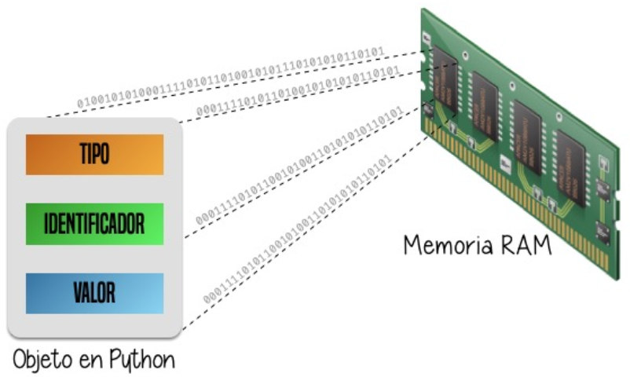

---

### Tipos de datos

Los tipos de datos básicos con los que podemos trabajar son variados.

### Conociendo los tipos de datos

| Nombre | Tipo | Ejemplo |
| --- |---| ---|
| Booleano| bool | True, False |
| Entero | int | 21, 34500, 34_500 |
| Flotante | float | 3.14, 1.5, 1.8e3 |
| Complejo | complex | 2j, 3+5j |
| Cadena | str | 'Salta', "Mia", '''Tengo sueño''' |
| Tupla | tuple | (1, 3, 5) |
| Lista | list | ['Chrome', 'Firefox', 'Brave'] |
| Conjunto | set | set([2, 4, 6]) |
| Diccionario | dict | {'Chrome': 'v79', 'Firefox': 'v71'} |

---

### Variables

Las **variables** son fundamentales ya que nos permiten definir **nombres** para los **valores** que tenemos en memoria y que vamos a usar en nuestro programa:


### Reglas para nombrar una variable

En Python podemos considerar una serie de reglas para los nombres de las variables:

1. Si bien podemos usar cualquier carácter, va a ser una **buena práctica** que el nombre de la variable sólo contengan los siguientes caracteres:
- Letras minúsculas.
- Letras mayúsculas.
- Dígitos.
- Guiones bajos (_)

2. Deben **empezar con una letra** o un **guión bajo**, nunca con un dígito.

3. No pueden ser una **palabra reservada del lenguaje** (keywords).
Podemos obtener un listado de las palabras reservadas del lenguaje de la siguiente forma:

```python
help('keywords')
```

> Importante: Los nombres de variables son «case-sensitive». Por ejemplo, stuff y Stuff son nombres diferentes.

---

### Convenciones para nombres

Mientras se sigan las reglas que vimos para nombrar variables, no hay problema en la forma en la que se escriban, pero si existe una convención para la **nomenclatura de las variables**.

Podemos utilizar el llamado **snake_case** en el que usaremos caracteres en minúsculas (incluyendo dígitos en el caso que sean necesarios) junto a guiones bajos cuando sean necesarios para su legibilidad.

También podemos utilizar **camelCase** que es un estilo de escritura en el que las palabras se escriben juntas sin espacios ni guiones bajos, comenzando con minúscula y usando mayúscula para la primera letra de cada palabra adicional.

**PascalCase** es similar a camelCase, pero la primera letra también empieza en mayúscula. En este estilo, cada palabra comienza con una letra en mayúscula y no se utilizan espacios ni guiones bajos.

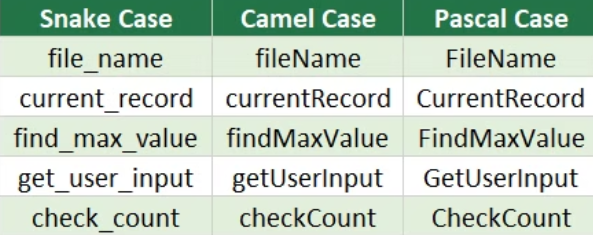

Esta convención, y muchas otras, están definidas en un documento denominado PEP (del término inglés Python Enhancement Proposals). Se trata de una guía de estilo para escribir código en Python. Los PEPs son las propuestas que se hacen para la mejora del lenguaje.

---

### Constantes

Un caso especial que debemos destacar son las **constantes**. Podríamos decir que es un tipo de variable... pero que su valor no cambia a lo largo de nuestro programa. Un ejemplo de la realidad es la velocidad de la luz. Sabemos que su valor es constante de 300.000 km/s.

En el caso de las constantes utilizamos **mayúsculas** (incluyendo guiones bajos si es necesario) para nombrarlas. Para la velocidad de la luz nuestra constante se podría llamar: 

> **VELOCIDAD_DE_LA_LUZ**

---

### Elegir buenos nombres

Se suele decir que un programador (con cierta experiencia), a lo que dedica más tiempo es a buscar un buen nombre para sus variables. Quizá suene algo excesivo, pero nos da una idea de lo importante que es esta tarea.

Es fundamental que los nombres de las variables sean **autoexplicativos**, pero tomando en cuenta también que el nombre sea conciso y claro.

Supongamos que queremos buscar un nombre de variable para almacenar el número de elementos que se debe manejar en un pedido:

1. n
2. num_elementos
3. numero_de_elementos
4. numero_de_elementos_a_manejar

No existe una regla mágica que nos diga a nosotros cuál es el nombre perfecto, pero podemos aplicar nuestro sentido común y, a través de la experiencia, ir detectando aquellos nombres que sean más adecuados.

En el ejemplo anterior, podemos descartar tanto la primera como la cuarta, por ser muy cortas o demasiado largas, nos quedaríamos con las otras dos. Si nos fijamos bien, no hay mucha información adicional entre la 3 y la 2, por lo que podríamos concluir que la opción 2 es válida para nuestras necesidades. Aún asi, todo dependerá siempre del contexto del problema que estemos tratando.

Como regla general:

- Usar **nombres** para **variables** (ejemplo: `elemento`)
- Usar **verbos** para **funciones** (ejemplo: `obtener_elemento()`)
- Usar **adjetivos** para **booleanos** (ejemplo: `disponible`)

---

### Asignación

En Python se usa el símbolo `=` para **asignar** un valor a una variable:


Es importante que diferenciemos la **asignación** en Python con la igualación en **matemáticas**. El símbolo `=` lo aprendimos desde siempre como una **equivalencia** entre dos **expresiones algebraicas**, sin embargo en Python nos indica una **sentencia de asignación** del valor en la derecha al nombre de la izquierda.

Veamos algunos ejemplos de asignaciones a variables:

```python
poblacion_total = 157700
temperatura_promedio = 16.8
nombre_dueño = 'Franco'
```

Veamos algunos ejemplos de asignaciones a constantes:

```python
VELOCIDAD_DE_LA_LUZ = 300000
VELOCIDAD_DEL_SONIDO = 343.2
NOMBRE_DE_LA_GALAXIA = 'Vía Láctea'
```

Python también nos permite hacer una **asignación múltiple** de la siguiente manera:

```python
tres = three = drei = 3
```

En este caso, estas tres variables utilizadas en el lado izquierdo tomarán el valor **3**.

Recordemos que los nombres de variables deben seguir unas **reglas establecidas**, de lo contario obtendremos un **error sintáctico del intérprete de Python**:

```python
7piso = 40 # el nombre empieza por un número
for = 'Bucle' # estamos usando la palabra reservada "for"
ancho-pixeles = 1920 # estamos usando un carácter no válido "-"
```

---

### Asignando una variable a otra variable

Las asignaciones que hicimos hasta ahora fueron de un **valor literal** a una variable. Pero nada nos impide que podamos hacer asignaciones de una variable a otra variable:

```python
personas = 157503
poblacion_total = personas
```

Eso sí, la variable que utilicemos como valor de asignación **debe existir previamente**, ya que si no es así, obtendremos un error informando de que no está definida en ningún lado:

```python
poblacion_total = mucha_gente # Error si mucha_gente no existe
```

De hecho, en el lado derecho de la asignación pueden aparecer expresiones más complejas que veremos más adelante.

---

### Conocer el valor de una variable

Ya vimos cómo debemos asignar un valor a una variable, pero aún no sabemos cómo **comprobar** el valor que tiene dicha variable. Para ello podemos elegir entre dos estrategias:

1. Si estamos usando un **intérprete** de Python como la consola, nos basta con que usemos el nombre de la variable:

```python
stock_total = 3200
stock_total
```

2. Si estamos escribiendo un programa desde un **editor**, debemos hacer uso de la instrucción **`print()`**:

```python
stock_total = 3200
print(stock_total)
```

---

### Mutabilidad (explicado muy sencillo)

Las variables son **nombres**, no **lugares**. Detrás de esta frase se esconde la reflexión de que cuando asignamos un valor a una variable, lo que realmente está ocurriendo es que se hace **apuntar** el nombre de la variable a una zona de memoria en el que se representa el objeto (con su valor):

```python
a = 5
```

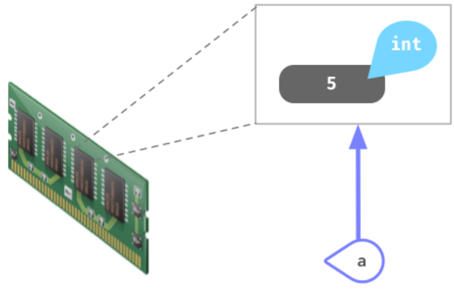

Si ahora **copiamos** el valor de `a` en otra variable `b` se podría esperar que hubiera otro espacio en memoria para dicho valor, pero como ya lo mencionamos, son referencias a memoria:

```python
b = a
```

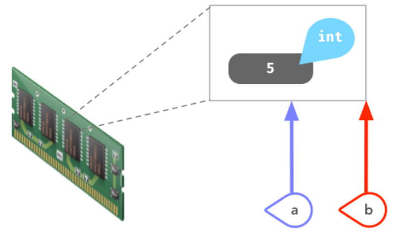

La función `id()` nos permite conocer la dirección de memoria de un objeto en Python. A través de ella podemos comprobar que los dos objetos que hemos creado **apuntan** a la misma zona de memoria.

Cuando la zona de memoria que ocupa el objeto se puede modificar hablamos de tipos de datos **mutables**. En otro caso hablamos de tipos de datos **inmutables**.

Por ejemplo, las **listas** son un tipo de dato mutable ya que podemos modificar su contenido (aunque la asignación de un nuevo valor sigue generando un nuevo espacio de memoria).

Es importante saber que el hecho de que un tipo de dato sea inmutable significa que no podemos modificar su valor **in-situ**, pero siempre podremos asignarle un nuevo valor (hacerlo apuntar a otra zona de memoria).

---

### Conversiones implícitas y explícitas

El hecho de que existan distintos tipos de datos es una ventaja a la hora de representar información del mundo real de la mejor manera posible. Pero también se hace necesario buscar mecanismos para convertir unos tipos de datos en otros.

**Conversión implícita**
Cuando mezclamos enteros, booleanos y flotantes, Python realiza automáticamente una conversión implícita (o **promoción**) de los valores al tipo de **mayor rango**. Veamos algunos ejemplos:

```python
True + 25 # Da 26 (True = 1)
7 * False # Da 0 (False = 0)
10 + 11.3 # Da 21.3 (Float)
```

**Conversión explícita**
Existen una serie de funciones para realizar conversiones explícitas de un tipo a otro:
- **`bool()`** Convierte el tipo a booleano.
- **`int()`** Convierte el tipo a entero.
- **`float()`** Convierte el tipo a flotante.

Ejemplos:

```python
bool(1) # True
int(False) # 0
float(1) # 1.0
```

---

### Función print, type y input

Estas tres funciones son fundamentales y vienen incorporadas (built-in) en Python:

**Conocer el tipo de una variable con `type()`**
Para poder descubrir el tipo de un valor literal o una variable, Python nos ofrece la instrucción `type()`. Veamos algunos ejemplos:

```python
type(9) # <class 'int'>
velocidad_del_sonido = 343.2
print(type(velocidad_del_sonido)) # <class 'float'>
```

**Mostrar información con `print()`**
La función `print()` permite mostrar texto y variables en la consola. Además de su uso básico, admite algunos parámetros interesantes como `sep` (para cambiar el separador entre elementos) y `end` (para cambiar cómo termina la línea).

```python
msg1 = '¿Sabes por qué estoy acá?'
msg2 = 'Porque me apasiona'
print(msg1, msg2, sep=' | ', end='!!')
```

**Leer datos desde teclado con `input()`**
Para solicitar la entrada de datos por teclado al usuario se utiliza la función `input()`. 

```python
nombre = input('Introduzca su nombre: ')
print(nombre)
```

> **Importante:** La función `input()` siempre nos devuelve un objeto de tipo cadena de texto (`str`). Si queremos leer un número, debemos usar una conversión explícita como `int(input('Edad: '))`.

---

## Estructuras de Control

En la clase de hoy vamos a ver cómo los programas no siempre se ejecutan en línea recta. Tenemos dos conceptos clave:
- **Estructuras de datos:** Conjunto o colección de valores organizados en memoria.
- **Estructuras de control:** Permiten estructurar un programa para hacerlo más fácil de leer, verificar y mantener.

Existen tres tipos de estructuras de control:
- **Secuencial:** una instrucción sigue a otra (lo que venimos haciendo).
- **Repetitiva:** repite instrucciones (ciclos).
- **Selectiva:** toma decisiones lógicas (condicionales).

---

### Control de flujo

Todo programa informático está formado por *instrucciones* que se ejecutan en forma secuencial de arriba hacia abajo, como si estuviésemos leyendo un libro. Este orden constituye el llamado **flujo** del programa. 

Es posible modificar este flujo secuencial para que tome *bifurcaciones* o *repita* ciertas instrucciones. Las sentencias que nos permiten hacer estas modificaciones se engloban en el **control de flujo**.

---

### Comentarios

Los comentarios son anotaciones que podemos incluir en nuestro programa y que nos van a permitir aclarar ciertos aspectos del código. Estas indicaciones son ignoradas por el intérprete de Python, es decir, no se ejecutan.

En Python tenemos dos formas de hacer comentarios:
- **`#`** → Sirve para comentar una sola línea.
- **`''' '''`** → Sirve para escribir comentarios de múltiples líneas.

Veamos unos ejemplos:

```python
# Edad del Universo expresando en días (comentario de una línea)
edad_del_universo = 13800 * (10 ** 6) * 365

'''
Este es un comentario
que ocupa
varias líneas
'''
```

---

### Definición de bloques

A diferencia de otros lenguajes que utilizan llaves para definir los bloques de código, Python quiso evitar estos caracteres por considerarlos innecesarios. 

Es por ello que en Python los bloques de código se definen a través de **espacios en blanco, preferiblemente 4**. En términos técnicos se habla de **tamaño de indentación**.


Python nos recomienda 4 espacios en blanco para indentar (o usar la tecla TAB). Esto es fundamental para que funcionen los condicionales y los ciclos.

---

### Condicionales (if, elif, else)


La sentencia condicional (Selectiva) en Python es **if**. Nos permite tomar decisiones lógicas. En su escritura debemos añadir una **expresión de comparación (condición)** terminando con **dos puntos al final** de la línea. 

**Selectiva Simple (if-else)**
Veamos un ejemplo:

```python
temperatura = 40
if temperatura > 35:
    print('Aviso por alta temperatura')
else:
    print('Parámetros normales')
```

**Selectiva Múltiple (if-elif-else)**
Podríamos tener múltiples condiciones para evaluar distintos casos. Python nos ofrece la sentencia **elif** para hacer esto mucho más fácil:

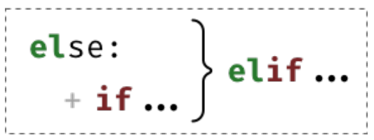

Veamos cómo se aplica:

```python
temperatura = 28
if temperatura < 20:
    print('Nivel verde')
elif temperatura < 30:
    print('Nivel naranja')
else:
    print('Nivel rojo')
```

---

### Ciclos (for)

*(Contenido pendiente - Falta teoría sobre for en los apuntes)*

#### Ejercicios Prácticos (para hacer entre todos)

1. **El premio:** Pedir un número de cliente por teclado. Si el número es 1000, imprimir "Ganaste un premio".
2. **El menor:** Pedir dos números por teclado y mostrar en pantalla cuál es el menor (no hace falta considerar qué pasa si son iguales).
3. **Tabla de multiplicar:** Usando un ciclo `for`, pedir un número y mostrar su tabla de multiplicar.
4. **Sumatoria:** Usar un ciclo `for` para sumar todos los números del 100 al 200 y mostrar el resultado final.
