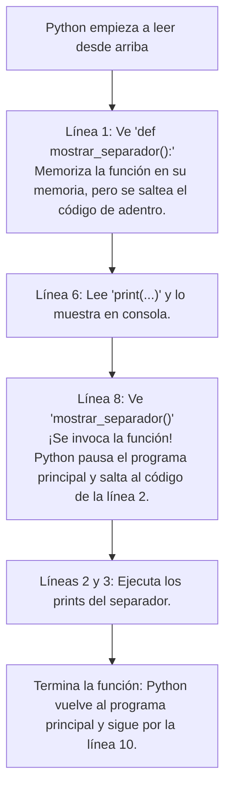

# Funciones: Introducción y Flujo — Clase 8

---

## 🖥️ Diapositiva 1 — El código repetitivo (El gran embole)

La clase pasada Juanse armó un fixture para el Mundial 2022 que quedó buenísimo y funciona de 10. ¡Felicitaciones a Juanse! 

Pero si miramos el código de cerca, hay un detalle: es sumamente repetitivo. Escribimos la misma estructura una y otra vez para cada grupo y para cada partido de octavos, cuartos y semis.

¿Qué pasa si mañana el cliente (por ejemplo, Diario El Tribuno) nos pide que cambiemos el diseño de la línea que separa los partidos o que agreguemos un delay de 2 segundos antes de mostrar el resultado?
* Tendríamos que buscar en nuestro código y modificar la misma línea en **15 lugares distintos**.
* Es facilísimo equivocarse, olvidarse de alguna o romper la indentación.
* Escribimos un código enorme al vicio.

Para evitar esto, en programación usamos el principio **DRY (Don't Repeat Yourself)**: *"No te repitas"*. Y la herramienta principal para lograrlo son las **Funciones**.

---

## 🖥️ Diapositiva 2 — ¿Qué es una Función?

Una **función** es como un botón personalizado que creás en tu control remoto o en el microondas. 

Veamos tres ejemplos de la vida real y la robótica para entenderlo a la perfección:

* **Ejemplo 1 — El botón "Descongelar" del microondas:** 
  Cuando apretás este botón, vos no le estás diciendo paso a paso: *"Encendé el plato giratorio, poné la potencia en 30%, esperá 2 minutos, hacé sonar la alarma"*. Todo ese grupo de pasos ya está grabado bajo el nombre de ese único botón.

* **Ejemplo 2 — El botón "Modo Cine" en una casa inteligente:** 
  Si querés ver una película, en vez de ir lámpara por lámpara apagando las luces, bajando las persianas y encendiendo la tele una por una, apretás un solo botón en una app que dice *"Modo Cine"*. Ese botón es una rutina que ejecuta todas esas acciones juntas al toque.

* **Ejemplo 3 — Los "Bloques Rosas" en Scratch o LEGO Spike (¡Mis Bloques!):** 
  En robótica, cuando programan con bloques y quieren que el robot haga un giro complejo o una rutina de calibración, en vez de arrastrar los mismos 5 bloques de motor cada vez, pueden crear un **bloque rosa personalizado** en la sección *"Mis Bloques"*, ponerle de nombre `giro_u` y usar ese único bloque en el programa. ¡Eso es exactamente una función!

En Python, una función es exactamente eso:
1. Agrupamos un bloque de instrucciones que hacen algo específico.
2. Le ponemos un nombre (el "botón" o "bloque rosa").
3. Cada vez que nombramos la función (apretamos el botón), Python ejecuta todas esas instrucciones juntas.

---

## 🖥️ Diapositiva 3 — Cómo crear una función (Sintaxis)

Para crear nuestra propia función en Python usamos la palabra reservada **`def`** (que viene de *define*, en inglés).

Miremos las reglas de sintaxis de este ejemplo básico:

```python
def mostrar_separador():
    print("------------------------------")
    print("   ")
```

* **`def`**: Le avisa a Python: *"Ojo, acá arranca la definición de una función"*.
* **`mostrar_separador`**: Es el nombre que elegimos para nuestra función. Usamos nombres autoexplicativos y estilo `snake_case` (todo en minúsculas y con guiones bajos).
* **Los paréntesis `()`**: Son obligatorios (más adelante servirán para meter "ingredientes", pero por ahora van vacíos).
* **Los dos puntos `:`**: Indican que a continuación viene el bloque de código de la función.
* **La indentación (4 espacios)**: Todo lo que esté corrido hacia la derecha pertenece a la función. Si no indentás, Python no se entera de qué instrucciones forman parte de tu función.

---

## 🖥️ Diapositiva 4 — ¿Cómo se usa una función? (Invocación)

Cuando vos definís una función usando `def`, Python simplemente la **memoriza** en su cabeza, pero **NO ejecuta las instrucciones** en ese momento. Es como escribir la receta de una torta: escribirla no hace que la torta aparezca mágicamente.

Para que la función realmente haga su trabajo, tenemos que **llamarla** (o invocarla) escribiendo su nombre seguido de los paréntesis.

Mirá este ejemplo de cómo usaríamos nuestra función para separar los partidos del mundial:

```python
# Primero definimos la función (Python la memoriza)
def mostrar_separador():
    print("------------------------------")
    print("   ")

# Ahora la usamos en nuestro programa principal
print("Primer partido de octavos:")
print("Argentina vs Australia")
mostrar_separador() # Invocamos la función

print("Segundo partido de octavos:")
print("Francia vs Polonia")
mostrar_separador() # Invocamos la función de nuevo
```

Si corremos este programa en la terminal, la salida por consola va a ser:

```text
Primer partido de octavos:
Argentina vs Australia
------------------------------
   
Segundo partido de octavos:
Francia vs Polonia
------------------------------
   
```

---

## 🖥️ Diapositiva 5 — El flujo de ejecución

Para entender cómo piensa Python, tenemos que ver el camino que recorre línea por línea (el flujo):



**Acordate siempre de esto:** Si definís una función pero nunca la llamás en tu código con los paréntesis `()`, la función nunca se va a ejecutar. 

---

## 🖥️ Diapositiva 6 — Ejercicios Prácticos

### Ejercicio 1: La bienvenida al Mundial
Creá una función llamada `mostrar_bienvenida()` que imprima por pantalla un cartel decorativo bien bonito para el inicio del programa. Invocalá al principio de tu archivo.

* **Resultado esperado por consola:**
```text
===================================
¡BIENVENIDO AL FIXTURE DEL MUNDIAL!
===================================
```

---

### Ejercicio 2: El separador de partidos de Juanse
En el fixture de Juanse se repetía muchas veces la impresión de las líneas de `vs` con separadores. Escribí una función llamada `mostrar_separador_partido()` que imprima una línea de asteriscos, un espacio y prepare el terreno de forma bonita. Invocalá tres veces seguidas en tu programa para ver el resultado.

* **Resultado esperado por consola al llamarla 3 veces:**
```text
********** VS **********

********** VS **********

********** VS **********

```

---

### Ejercicio 3: Festejo del Campeón
Creá una función llamada `festejar_campeon()` que muestre un festejo con emojis y estrellitas cuando se ingrese el campeón final del fixture.

* **Resultado esperado por consola:**
```text
🏆🏆🏆🏆🏆🏆🏆🏆🏆🏆🏆🏆🏆🏆🏆🏆🏆🏆🏆
🎉 ¡ATENCIÓN! ¡TENEMOS UN NUEVO CAMPEÓN! 🎉
⭐⭐⭐⭐⭐⭐⭐⭐⭐⭐⭐⭐⭐⭐⭐⭐⭐⭐⭐
```

---

### Ejercicio 4: Menú de opciones del fixture
Escribí una función llamada `mostrar_menu()` que le presente al usuario las opciones disponibles de nuestro programa.

* **Resultado esperado por consola:**
```text
--- MENÚ DEL FIXTURE ---
1. Ver grupos
2. Definir octavos
3. Definir cuartos
4. Salir
------------------------
```

---

### Ejercicio 5: Buscando el Error (Debugging)
Mirá este código que armó un alumno para intentar automatizar el reporte de estado de los motores de su robot. No funciona como él esperaba: no imprime nada y tira un error de sintaxis al intentar ejecutarlo.
**¿Cuáles son los dos errores que cometió y cómo los arreglamos?**

```python
def reportar_motores()
print("Motores inicializados correctamente")
print("Estado: Activos y listos")

# Llamamos a la función
reportar_motores
```

---
---

# 📋 Machete del Profe

---

### Diapositiva 1 — El código repetitivo (El gran embole)
Arrancá la clase felicitando en público a Juanse por el fixture del mundial. Mapealo en la pantalla de la clase para que todos lo vean. Deciles: *"Miren qué bueno que está este código, resuelve todo el mundial. Pero miren qué pasa si quiero cambiar el formato de los partidos a la mitad de la clase... tengo que ponerme a cambiar a mano 15 prints diferentes. Qué embole, ¿no?"*. Dejalos que procesen esa frustración, es el enganche perfecto para presentar las funciones.

---

### Diapositiva 2 — ¿Qué es una Función?
Usá la analogía del control remoto o el microondas. Todos los chicos usan microondas o controles remotos. Que entiendan que una función es una forma de "empaquetar" muchos pasos en un solo botón físico. Remarcá que esto nos da control y orden sobre nuestro código.

---

### Diapositiva 3 — Cómo crear una función (Sintaxis)
Enfocate muchísimo en dos cosas:
1. **Los dos puntos `:` al final del def.** Es un error súper común que se lo olviden.
2. **La indentación de 4 espacios.** Recordales que Python es delicadísimo con el orden y que la indentación le dice al intérprete qué líneas forman parte de la función y cuáles están afuera.

---

### Diapositiva 4 — ¿Cómo se usa? (Invocación)
Explicá de forma gráfica la diferencia entre "memorizar" (definir con `def`) y "ejecutar" (llamar con los paréntesis `()`). Podés hacer una broma como: *"Si escribís la receta de una pizza en un papel y te la guardás en el bolsillo, ¿aparece la pizza sola en la mesa? No, la tenés que cocinar. Los paréntesis `()` son la orden de cocinar"*.

---

### Diapositiva 5 — El flujo de ejecución
Este es el concepto más difícil de entender al principio. A los chicos les cuesta asimilar que el código no siempre corre de arriba a abajo en línea recta cuando hay funciones. Dibujá flechas en el pizarrón mostrando cómo Python "salta" hacia la función cuando la encuentra y luego "vuelve" al lugar exacto donde estaba en el programa principal.

---

### Diapositiva 6 — Ejercicios Prácticos
* **Ejercicio 1 a 4:** Son sencillos para que asimilen la sintaxis de `def` e incorporen f-strings o emojis. Dales 10-15 minutos para resolverlos en vivo.
* **Ejercicio 5 (Debugging):** La clave es que detecten:
  1. Falta el `:` al final del `def reportar_motores()`.
  2. Los prints de adentro de la función no tienen los 4 espacios de indentación.
  3. Al final, se llamó a `reportar_motores` sin los paréntesis `()`, por lo que Python no hace nada (no la ejecuta).
  Pasate por el banco de Laureano para asegurarte de que entienda la indentación. Si ves que a Diego le sale rápido, animalo a que intente combinar el menú de opciones con un ciclo `while` para que se repita.
