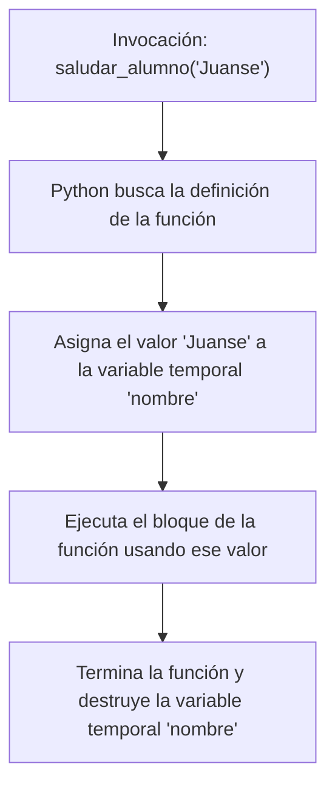

# Parámetros y Librerías Básicas — Clase 9

---

## 🖥️ Diapositiva 1 — ¿Qué es una Librería en Python?

Cuando programamos, no tenemos que inventar la rueda desde cero cada vez. 

Imaginate que estás armando un robot de LEGO. LEGO te da los bloques básicos, pero si querés agregarle un motor o un sensor de color, vos no te ponés a fabricar el sensor fundiendo plástico ni soldando cables de cobre. Usás el sensor que ya viene armado y listo para conectar.

En programación, las **Librerías** (o módulos) son exactamente eso: **cajas de herramientas con código que otra persona ya escribió y probó**, listas para que las usemos en nuestros programas.

Por ejemplo:
* Si queremos hacer cálculos matemáticos complejos, importamos la librería `math`.
* Si queremos controlar los motores y sensores de nuestro robot, importamos la librería `pybricks`.
* Si queremos limpiar la consola de Windows o hacer pausas de tiempo, importamos las librerías `os` y `time`.

Para poder usar una librería en nuestro archivo, simplemente usamos la palabra reservada **`import`** al principio de todo.

---

## 🖥️ Diapositiva 2 — El suspenso y la limpieza (Librerías `os` y `time`)

Hoy usaremos dos librerías del sistema que están buenísimas para que nuestros programas en la terminal parezcan juegos de verdad:

### 1. La librería `os` (Operating System)
Nos sirve para interactuar con el sistema operativo de nuestra computadora. La orden que usaremos hoy es **borrar la consola** (`os.system('cls')`) para limpiar el texto viejo y dejar la pantalla impecable.
```python
import os

# Borra todo el texto acumulado en la pantalla de Windows
os.system('cls')
```

### 2. La librería `time`
Nos sirve para manejar el tiempo en nuestros programas. La orden más usada es **pausar la ejecución** (`time.sleep(segundos)`) durante el tiempo que le indiquemos. Es ideal para simular que el robot está procesando algo o para agregar suspenso.
```python
import time

print("Preparando el robot...")
time.sleep(2) # Pausa el programa por 2 segundos enteros
print("¡Robot listo para arrancar!")
```

---

## 🖥️ Diapositiva 3 — Las funciones estáticas (El límite)

Imaginate que queremos dar una bienvenida personalizada a cada alumno al iniciar la clase. Ya sabemos crear funciones, así que podríamos intentar hacer algo así:

```python
def saludar_juanse():
    print("Hola Juanse, ¡bienvenido a clase!")

def saludar_diego():
    print("Hola Diego, ¡bienvenido a clase!")
```

Si tenemos 20 alumnos en el aula, tendríamos que escribir **20 funciones distintas**, una para cada uno. 

¿Ves el problema? Duplicar código así es una pésima idea. Rompe por completo el principio **DRY (Don't Repeat Yourself)** que vimos la clase pasada y hace que nuestro archivo sea enorme al vicio.

Necesitamos una forma de hacer una única función `saludar_alumno()` y poder decirle el nombre del alumno específico cada vez. Para resolver esto existen los **Parámetros**.

---

## 🖥️ Diapositiva 4 — ¿Qué es un Parámetro?

Un **parámetro** es como un **espacio en blanco** o una ranura que le dejás a la función para que reciba información cuando la invocás.

Pensalo con estas dos analogías muy sencillas:

* **La Licuadora (Analogía de la cocina):**
  Una licuadora es una función llamada `licuar()`. Pero para que funcione, necesita un **ingrediente**. El ingrediente es el **parámetro**. Si le pasás una banana, te devuelve licuado de banana; si le pasás frutilla, te devuelve licuado de frutilla. La máquina hace la misma acción, pero el resultado cambia según lo que le metas dentro.

* **Los bloques de LEGO Spike / Pybricks (Robótica):**
  Cuando usás un bloque en Pybricks para mover un motor, por ejemplo:
  ```python
  motor.run_angle(velocidad=500, angulo=90)
  ```
  `velocidad` y `angulo` son parámetros. El motor sabe girar, pero vos tenés que pasarle los números exactos de qué tan rápido y cuánto querés que gire.

En Python, un parámetro es una **variable especial** que se declara entre los paréntesis de la función. Solo existe dentro de esa función y se llena de información únicamente cuando la llamamos.

---

## 🖥️ Diapositiva 5 — Cómo crear una función con parámetros (Sintaxis)

Miremos las reglas de sintaxis de este ejemplo:

```python
def saludar_alumno(nombre):
    # Usamos la variable 'nombre' adentro de la función
    print(f"Hola {nombre}, ¡bienvenido a clase!")
```

* **`nombre`**: Es nuestro parámetro. Es una variable que colocamos dentro de los paréntesis obligatorios en la definición del `def`.
* **Uso interno**: Fijate cómo usamos `nombre` dentro del cuerpo de la función como si fuera cualquier otra variable común (usando f-strings).
* **Sin valor inicial**: Al definir la función, no le asignamos ningún valor al parámetro. Simplemente le avisamos a Python: *"Ojo, cuando usen esta función, te van a pasar un dato acá adentro"*.

---

## 🖥️ Diapositiva 6 — Invocando con argumentos

Una vez definida la función, cuando la llamamos en nuestro código, debemos pasarle el valor real que tomará el parámetro. A este valor real se le llama **argumento**.

```python
# Definimos la función con su parámetro
def saludar_alumno(nombre):
    print(f"Hola {nombre}, ¡bienvenido a clase!")

# Invocamos la función pasando diferentes argumentos
saludar_alumno("Juanse")       # "Juanse" es el argumento. 'nombre' vale "Juanse".
saludar_alumno("Diego")        # Ahora 'nombre' vale "Diego".
saludar_alumno("Laureano")     # Ahora 'nombre' vale "Laureano".
```

### El viaje de la información (Flujo):


Si te olvidás de pasar el argumento al llamar a la función (ejemplo: `saludar_alumno()`), Python se va a quejar con un error de tipo `TypeError` porque le falta el ingrediente obligatorio.

---

## 🖥️ Diapositivas 22 a 28 — Ejercicios Prácticos

### 📝 Poniendo en práctica 01 — Creando un menú interactivo
Vamos a inventar nuestro primer menú interactivo por consola usando:
* `os` para limpiar la pantalla
* `time` para agregar pausas

La idea es que el programa quede funcionando constantemente hasta que el usuario decida salir.

**La salida debería ser algo así:**
```text
Bienvenido!
1 - Elegir opción 1
2 - Elegir opción 2
3 - Elegir opción 3
Ingrese el número de la opción que desea elegir: 
```

---

### 📝 Poniendo en práctica 02 — Abriendo sobres de figuritas
Ahora simulemos la apertura de un paquete de 3 figuritas. Usaremos 3 librerías ahora:
* `random` para elegir figuritas al azar
* `time` para agregar suspenso
* `os` para limpiar la pantalla

Tenemos que simular la apertura del paquete, que nos de 3 figuritas al azar y nos las muestre una por una con suspenso.

Para la lista de jugadores, usá la siguiente lista predefinida:
```python
jugadores = [ "Geronimo Rulli", "Juan Musso", "Emiliano Martinez", "Marcos Senesi", "Nicolas Tagliafico", "Gonzalo Montiel", 
             "Lisandro Martinez", "Cristian Romero", "Nicolas Otamendi", "Facundo Medina", "Nahuel Molina", "Leandro Paredes", 
             "Rodrigo De Paul", "Valentin Barco", "Giovani Lo Celso", "Exequiel Palacios", "Alexis Mac Allister", 
             "Enzo Fernandez", "Julian Alvarez", "Lionel Messi", "Nicolas Gonzalez", "Thiago Almada", "Giuliano Simeone", 
             "Nicolas Paz", "Jose Manuel Lopez", "Lautaro Martinez" ]
```

**La salida nos debería quedar algo así, o más linda:**
```text
Primera figurita...
-> Nicolas Paz
Segunda figurita...
-> Nicolas Otamendi
Tercera figurita...
-> Lionel Messi
Eso es todo...
```

---

### 📝 Poniendo en práctica 03 — ¿Salió Messi?
Como desafío extra, podemos añadirle emoción a nuestro programa si es que nos sale Messi:
* **Mensaje esperado si toca Messi:**
  ```text
  🔥 ¡Te salió Messi!
  ```

---

### 📝 Poniendo en práctica 04 — ¿Solo 1 paquete?
Como desafío extra, le añadamos más emoción. Usando algún `while`, abramos varios paquetes a la vez.

---

### 📝 Poniendo en práctica 05 — ¿Y si sale alguna repetida?
Pensá cómo podés hacer para que el programa te avise si es que te salió algún jugador repetido.

* **Pista:** Quizá debas crear una lista con los jugadores que te vayan tocando.

---

# 📋 Machete del Profe

---

### Tips de Clase y Dinámica
* **Presentá las Librerías como packs de expansión (mods) de Minecraft:** Si querés bloques básicos, usás lo que viene por defecto. Si querés portales o herramientas especiales, importás un mod. En Python, las librerías son exactamente esos "mods" de código.
* **Planteá el caso de los saludos personalizados:** Es mucho más intuitivo que usar diccionarios o lógica de álbumes desde el inicio. Hacé que entiendan la necesidad de pasar datos a las funciones.
* **Analogía del ingrediente:** Remarcá que el parámetro es como el vaso de la licuadora antes de llenarlo; cuando llamamos a la función con un argumento, es cuando vertemos la fruta dentro.
* **Ojo con la llamada sin paréntesis:** Recordá que si los chicos escriben `configurar_velocidad` sin los paréntesis ni el argumento, Python no dará error de ejecución directamente pero tampoco hará nada, un error típico en Laureano y Diego.

### Seguimiento de Alumnos (Diagnóstico Específico)
* **Juanse:** Si termina rápido los ejercicios, proponele como desafío avanzado que en el **Ejercicio 2** modifique la función `moverse(distancia)` para que si recibe una distancia negativa o igual a cero, muestre un cartel de advertencia: *"Distancia inválida para avanzar"*.
* **Máximo:** Asegurate de que entienda la diferencia entre pasar números y cadenas de texto como argumentos en el **Ejercicio 3**.
* **Diego:** Recordale prestar especial atención al uso de las llaves `{}` dentro de las f-strings, sobre todo en el **Ejercicio 4** donde el parámetro está escrito como texto plano dentro de las comillas.
* **Laureano:** Ayudalo a escribir la definición de los parámetros paso a paso en el pizarrón o en su banco si es necesario, asegurándote de que recuerde poner los dos puntos `:` al definir el `def`.
