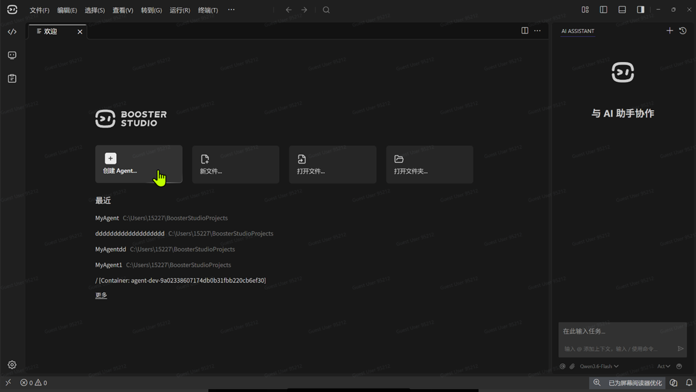
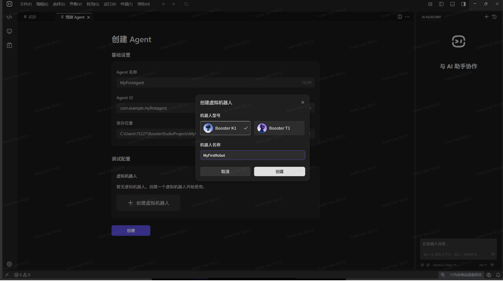
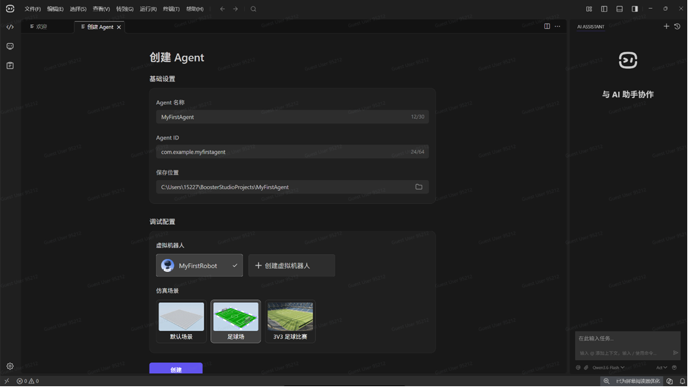
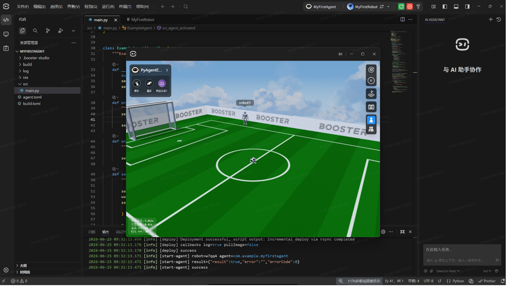
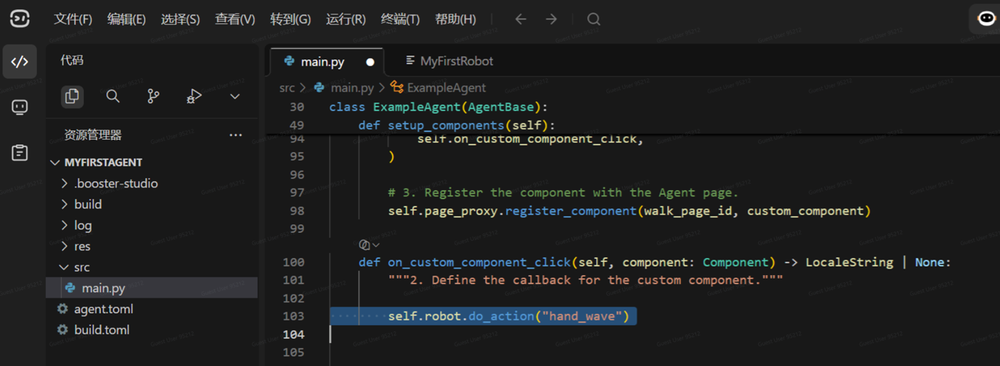
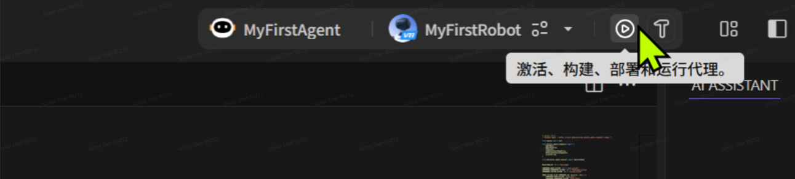
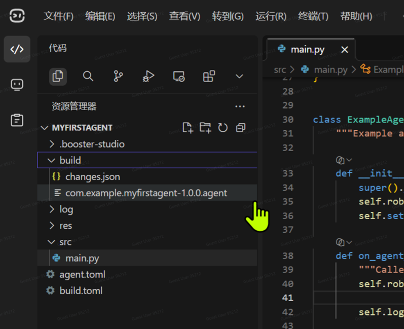
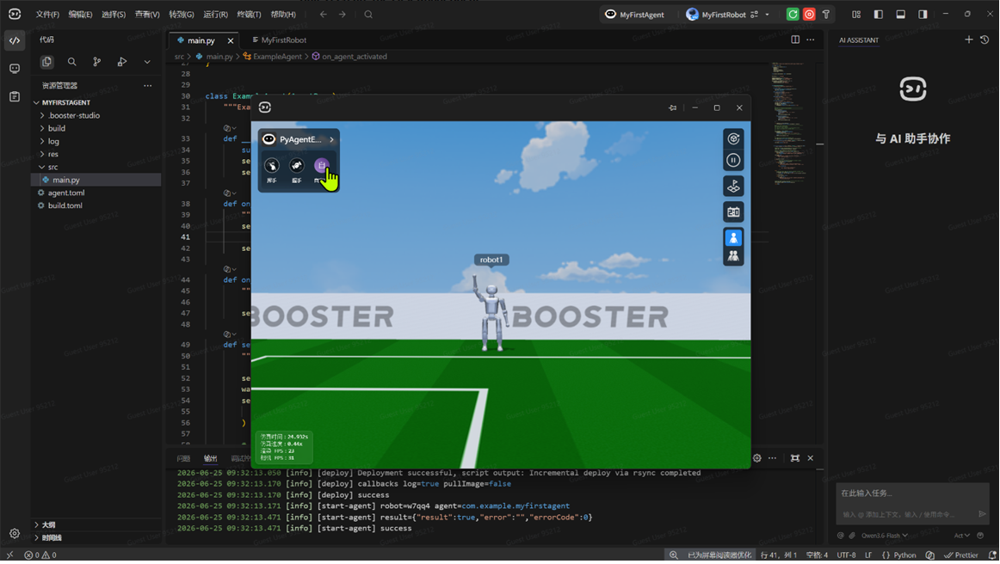

# Conociendo la Herramienta de Desarrollo de Agentes: Booster Studio

## Índice

- [Módulo 1: Introducción a Booster Studio](#módulo-1-introducción-a-booster-studio)
  - [Unidad 1: ¿Qué es Booster Studio?](#unidad-1-qué-es-booster-studio)
  - [Unidad 2: Requisitos de Hardware y Sistema Operativo](#unidad-2-requisitos-de-hardware-y-sistema-operativo)
  - [Unidad 3: Instalación de Booster Studio](#unidad-3-instalación-de-booster-studio)
  - [Unidad 4: Instalación de Docker](#unidad-4-instalación-de-docker)
  - [Unidad 5: Interfaz de Desarrollo](#unidad-5-interfaz-de-desarrollo)
  - [Unidad 6: Práctica – Crear un Agente](#unidad-6-práctica--crear-un-agente)
- [Módulo 2: Desarrollo del Primer Agente en Booster Studio](#módulo-2-desarrollo-del-primer-agente-en-booster-studio)
  - [Introducción al Módulo](#introducción-al-módulo)
  - [Unidad 1: Crear el Primer Agente](#unidad-1-crear-el-primer-agente)
  - [Unidad 2: Construcción y Despliegue del Agente](#unidad-2-construcción-y-despliegue-del-agente)
  - [Unidad 3: Flujo de Desarrollo de Agentes](#unidad-3-flujo-de-desarrollo-de-agentes)

---

## Módulo 1: Introducción a Booster Studio

Booster Studio es una plataforma integrada para el desarrollo de estrategias de robots. Ofrece un entorno de simulación visual, editor de código y herramientas de depuración, lo que permite que incluso principiantes puedan iniciarse rápidamente en la programación de agentes.

Este módulo explica cómo preparar el entorno de desarrollo para trabajar con Booster Studio: requisitos de hardware, sistemas operativos compatibles, instalación del programa y configuración del motor de simulación basado en Docker.

---

### Unidad 1: ¿Qué es Booster Studio?
Booster Studio es una herramienta creada para simplificar el desarrollo de robots, resolviendo problemas comunes como la dificultad de configurar múltiples entornos y la desconexión entre software y hardware.

**Características principales:**
- **Compatibilidad multiplataforma:** Funciona de manera nativa en Windows, macOS y Linux.
- **Sin configuraciones complejas:** No requiere configurar manualmente variables de entorno de ROS ni dependencias complicadas.
- **Listo para usar:** Tras la instalación, se puede ejecutar directamente, ofreciendo un entorno unificado para colaboración multiplataforma.
- **Ciclo completo:** Integra todo el ciclo de vida del desarrollo de agentes en un flujo único.
- **Asistente de IA (AI Coding):** Incluye funciones que generan automáticamente código en Python según el contexto.
- **Física de alta precisión:** Incorpora un motor físico que simula gravedad, fricción, límites dinámicos y ruido de sensores.
- **Sim-to-Real:** Permite que el mismo código funcione tanto en simulación como en robots reales sin modificaciones.
- **Datos multimodales:** Soporta escenas 3D, modelos URDF, imágenes en tiempo real y nubes de puntos.

---

### Unidad 2: Requisitos de Hardware y Sistema Operativo

#### Hardware recomendado:
- **CPU mínima:** AMD Ryzen 7 8745H o equivalente.  
- **CPU recomendada:** AMD R9 8945HX, R7 8840HS o Intel Core Ultra 9 285H.  
- **Memoria mínima:** 16 GB.  
- **Memoria recomendada:** 32 GB en doble canal.  
- **Gráficos:** GPU integrada (ejemplo: Radeon 780M).  
- **Mac:** Chip M4 con al menos 16 GB de RAM.

#### Sistemas operativos compatibles:
- **Windows:** Totalmente compatible (Win10 y Win11). Requiere WSL2 y Docker.  
- **Ubuntu (recomendado):** Versiones 22.04 o 24.04 LTS. Instalación más sencilla, sin virtualización.  
- **macOS:** Compatible, puede ejecutar tareas de simulación con Docker sin bloqueos.

#### Dependencias previas:
- **Windows:** WSL2 actualizado + Docker Desktop.  
- **Ubuntu:** Docker Engine / Desktop.  
- **macOS:** Docker Desktop.

> [!IMPORTANT]
> En Windows, es sumamente importante mantener WSL2 y Docker Desktop actualizados a la última versión disponible para garantizar la estabilidad de la simulación.

---

### Unidad 3: Instalación de Booster Studio
1. Descargar el instalador desde la página oficial.  
2. **Windows:** Ejecutar el instalador, seguir el asistente de instalación y crear un acceso directo.  
3. **macOS:** Abrir el archivo `.dmg` y arrastrar el ícono a la carpeta *Applications* (Aplicaciones).  
4. **Ubuntu:** Instalar utilizando el siguiente comando en la terminal:
   ```bash
   sudo dpkg -i booster-studio-xxx.deb
   ```

---

### Unidad 4: Instalación de Docker
Booster Studio utiliza Docker para encapsular el entorno de simulación en contenedores, evitando configuraciones locales complicadas.

#### Pasos para la instalación:
1. Descargar **Docker Desktop** desde la web oficial.
2. Instalar con las opciones por defecto (en Windows, asegúrate de marcar la casilla *"Use WSL 2 based engine"*).
3. Reiniciar el sistema tras completar la instalación.
4. Mantener Docker Desktop en ejecución en segundo plano mientras utilices Booster Studio.
5. Configurar WSL en Windows siguiendo la documentación oficial si el instalador lo solicita.

> [!NOTE]
> No es necesario crear una cuenta en Docker; Booster Studio controla el motor automáticamente en segundo plano.

---

### Unidad 5: Interfaz de Desarrollo
La interfaz de Booster Studio está diseñada específicamente para el desarrollo de agentes robóticos y se compone de:

- **Editor de código:** Compatible con plugins de VS Code y soporte completo para Python.
- **Construcción de agentes:** Botón dedicado para compilación y empaquetado del agente en un solo clic.
- **Gestión de robots:** Control de robots virtuales y reales desde la misma ventana.
- **Simulación:** Renderizado en tiempo real de modelos 3D, sensores y datos del entorno.
- **Registro de ejecución (LOG):** Permite grabar y reproducir información de ejecución para simplificar la depuración.
- **Asistente AI:** Genera y optimiza código automáticamente a partir de instrucciones en lenguaje natural.

---

### Unidad 6: Práctica – Crear un Agente
Booster Studio permite crear y probar un agente de manera virtual, sin necesidad de conectar un robot físico.

#### Pasos:
1. En la pantalla inicial, seleccionar la opción **Crear Agente**.




2. Revisar la estructura inicial del proyecto generado:
   - `agent.toml` (archivo de configuración del agente).
   - `src/main.py` (código con la lógica principal del robot).
3. Pulsar el botón **Construir, Activar, Desplegar y Ejecutar** en la barra de herramientas.
4. Booster Studio iniciará Docker automáticamente y cargará un robot virtual en el entorno 3D.
5. **Observar la simulación:** El agente aparecerá en la esquina superior izquierda del entorno, confirmando que está activo y ejecutando su lógica.

---

# Desarrollo del Primer Agente en Booster Studio

## Introducción al Módulo
El desarrollo de robots suele ser un proceso complejo que involucra múltiples sistemas y herramientas. Booster Studio ofrece una plataforma integrada que simplifica este trabajo, permitiendo a los desarrolladores concentrarse en la lógica de comportamiento del robot en lugar de en detalles técnicos complicados.

El **Booster Agent Framework** organiza la lógica de control y facilita la programación de acciones, eventos y componentes.

---

## Unidad 1: Crear el Primer Agente
1. En Booster Studio se puede crear un nuevo agente desde el panel principal.


2. Se asigna un nombre al agente y se define la ubicación del proyecto en tu disco.
3. Se selecciona un modelo de robot virtual (ejemplo: **Booster K1** o **Booster T1**) para pruebas en el entorno simulado.

4. Se elige un escenario de simulación, como un **campo de fútbol**.


5. Una vez cargado el entorno, el robot aparece en la simulación y el editor de código se inicializa con plantillas de ejemplo basadas en el framework.



---

## Unidad 2: Construcción y Despliegue del Agente
El código principal del agente se encuentra en el archivo `src/main.py`.

Para programar una acción al interactuar con la interfaz del agente, añadimos la siguiente instrucción dentro de la función `on_custom_component_click`:

```python
self.robot.do_action("hand_wave")
```




Esta función se ejecuta cuando se pulsa un botón personalizado en la interfaz del agente. Al activar, construir y desplegar el proyecto, el robot realizará la acción de saludar con la mano en el entorno simulado.




Una vez finalizada la construcción, el sistema genera automáticamente un archivo `.agent` en la carpeta `build`, el cual contiene el paquete del agente listo para su ejecución o distribución.




Entramos al entorno de simulación que se abrió automáticamente.  
En la esquina superior izquierda se muestra el agente que está siendo depurado en ese momento.  
Acabamos de modificar la función que se ejecuta al hacer clic en el botón personalizado.  
Al pulsar **Test**, podés ver cómo el robot comienza a saludar con la mano y decir:  
**"Hola Mundo"**.





---

## Unidad 3: Flujo de Desarrollo de Agentes
El proceso de desarrollo de un agente sigue un ciclo iterativo:

1. **Modificar el código:** Ajustar la lógica del agente en Python.
2. **Construir el agente:** Empaquetar el proyecto y verificar las dependencias.
3. **Desplegar:** Cargar el agente en el entorno de simulación.
4. **Observar y validar:** Verificar el comportamiento del robot en el simulador 3D.
5. **Iterar y optimizar:** Corregir errores y ajustar parámetros según los resultados obtenidos.

Los agentes pueden estructurarse en múltiples módulos funcionales:
- **Control de movimiento:** Desplazamiento y cinemática del robot.
- **Percepción del entorno:** Lectura y procesamiento de datos de sensores.
- **Toma de decisiones:** Lógica de comportamiento y algoritmos de control.
- **Colaboración:** Comunicación e interacción entre varios robots.

Booster Studio automatiza por completo la compilación y el empaquetado, eliminando la necesidad de manejar manualmente procesos técnicos complejos.