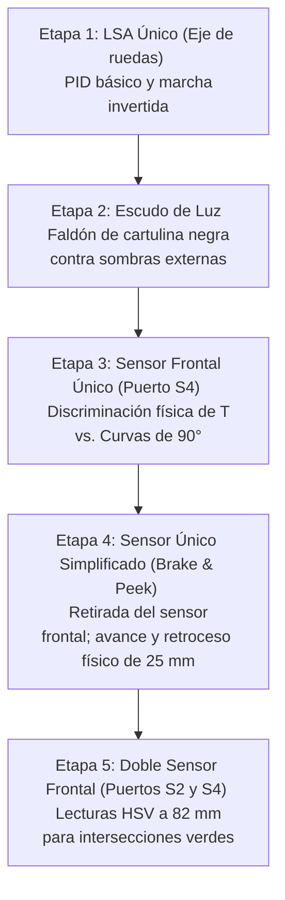

# Seguidor de Línea Avanzado (EV3 + Pybricks)

Este directorio contiene los códigos y reportes desarrollados durante las clases para el robot seguidor de línea de competencia (RoboCup Rescue Line). A continuación, se detalla la configuración física del robot, su distribución de hardware y cómo fue evolucionando según las necesidades de la pista.

---

## 🛠️ Configuración Física del Robot

### 1. Sistema de Tracción y Chasis
*   **Motores de Marcha:** Dos motores grandes LEGO EV3 conectados en los puertos **A (Derecho)** y **B (Izquierdo)**.
*   **Inversión de Marcha:** Para lograr una mejor respuesta de giro, se decidió invertir físicamente la marcha del robot. La parte trasera del diseño original pasó a ser el frente de avance.
    *   *Configuración en código:* `motor_izq` configurado como `CLOCKWISE` y `motor_der` como `COUNTERCLOCKWISE`.
*   **Geometría:** Ruedas de diámetro **43 mm** y un ancho de vía (distancia entre ejes de ruedas) de **200 mm**.

### 2. Disposición de los Sensores
*   **Sensor de Línea Principal (LSA):** Un array de 8 sensores analógicos **Mindsensors LightSensorArray (LSA)** conectado en el **Puerto S1**.
    *   *Efecto Dinámico:* Debido a la inversión del chasis, el LSA quedó montado muy cerca del eje de giro de las ruedas (a solo **25 mm** por delante de él). Al no tener "efecto palanca", el robot necesita coeficientes PID más agresivos ($KP = 4.5$, $KD = 22.0$) para evitar salirse en las curvas rápidas.
*   **Sensores de Color Frontales (RoboCup):**
    *   **Puerto S2:** Sensor de color EV3 Izquierdo.
    *   **Puerto S4:** Sensor de color EV3 Derecho (o sensor de luz frontal único en versiones previas).
    *   *Geometría de desfase:* Los sensores de color se montaron a **57 mm** por delante del LSA. Esto resulta en una distancia total de **82 mm** respecto al eje de rotación de las ruedas.

---

## 📈 Evolución Física y Algorítmica del Robot

A lo largo de las clases, la estructura física del robot fue modificada para solucionar diferentes problemas de navegación:

### 📅 Etapa 1: Descubrimiento del Hardware e Inversión (12 de Mayo)
*   **Cambio Físico:** Se invirtió el sentido del robot para probar la distribución de peso. Al hacerlo, el sensor principal (que se identificó mediante un escáner I2C como un **LSA** en la dirección `0x0A` en vez de un LineLeader) quedó pegado al eje de las ruedas.
*   **Desafío:** Sin efecto palanca al rotar, el robot perdía la línea fácilmente en curvas cerradas.
*   **Solución:** Se implementó el primer **Recovery Mode** (Memoria de retroceso): si se perdía la línea, retrocedía deshaciendo el último giro del PID.

### 📅 Etapa 2: Aislamiento Lumínico (19 de Mayo)
*   **Cambio Físico:** Se le añadió una **"pollerita" o faldón protector** de cartulina negra alrededor del sensor LSA.
*   **Desafío:** La luz ambiental (ventanas, focos del techo) generaba lecturas asimétricas y falsos positivos al cambiar de dirección en curvas.
*   **Solución:** Además del faldón físico, se dividió la calibración del verde en dos canales independientes (Izquierda y Derecha) para compensar sombras asimétricas del propio chasis.

### 📅 Etapa 3: Incorporación del Sensor Frontal de Luz (2 de Junio)
*   **Cambio Físico:** Se montó un sensor de color EV3 en el **Puerto S4**, centrado y por delante del LSA.
*   **Desafío:** El robot confundía curvas cerradas de 90° con intersecciones en T.
*   **Solución:** El sensor frontal permitía "mirar el futuro". Si el LSA detectaba un patrón de T, el robot frenaba y medía con el frontal: si veía negro (línea al frente), confirmaba la T y avanzaba derecho; si veía blanco, era una curva y el PID tomaba el giro.

### 📅 Etapa 4: Enfoques de Sensor Único (16 de Junio)
*   **Cambio Físico:** Se retiró el sensor frontal de luz para simplificar el hardware del robot, dejando únicamente el LSA.
*   **Solución en Software (Brake & Peek):** Al detectar una T, el robot avanza $25\text{ mm}$ derecho para verificar el centro de la pista con el LSA. Si no encuentra línea, **retrocede físicamente los mismos $25\text{ mm}$** marcha atrás hasta el vértice de la curva, permitiendo que el PID regular gire el chasis.
*   **Solución en Software (Rolling Window):** Evalúa el comportamiento de los sensores centrales en movimiento durante $250\text{ ms}$ para tomar decisiones sin necesidad de frenar ni retroceder.

### 📅 Etapa 5: Doble Sensor Frontal para RoboCup (Última versión)
*   **Cambio Físico:** Se montaron dos sensores de color EV3 delanteros en los puertos **S2 (Izquierdo)** y **S4 (Derecho)**, posicionados a **82 mm** del eje de giro de las ruedas.
*   **Desafío:** Detectar marcadores verdes a los lados de la línea y realizar los giros correspondientes en el centro de las intersecciones.
*   **Solución:** 
    *   Se utiliza un convertidor RGB-HSV por software para discriminar el verde de la pista.
    *   Al confirmar verde, el robot avanza exactamente los **82 mm** de desfase geométrico. Esto posiciona el eje de rotación de las ruedas directamente en el centro del cruce antes de pivotar $90^\circ$ o $180^\circ$.
